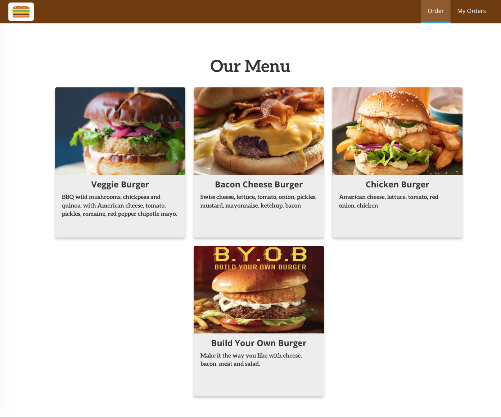
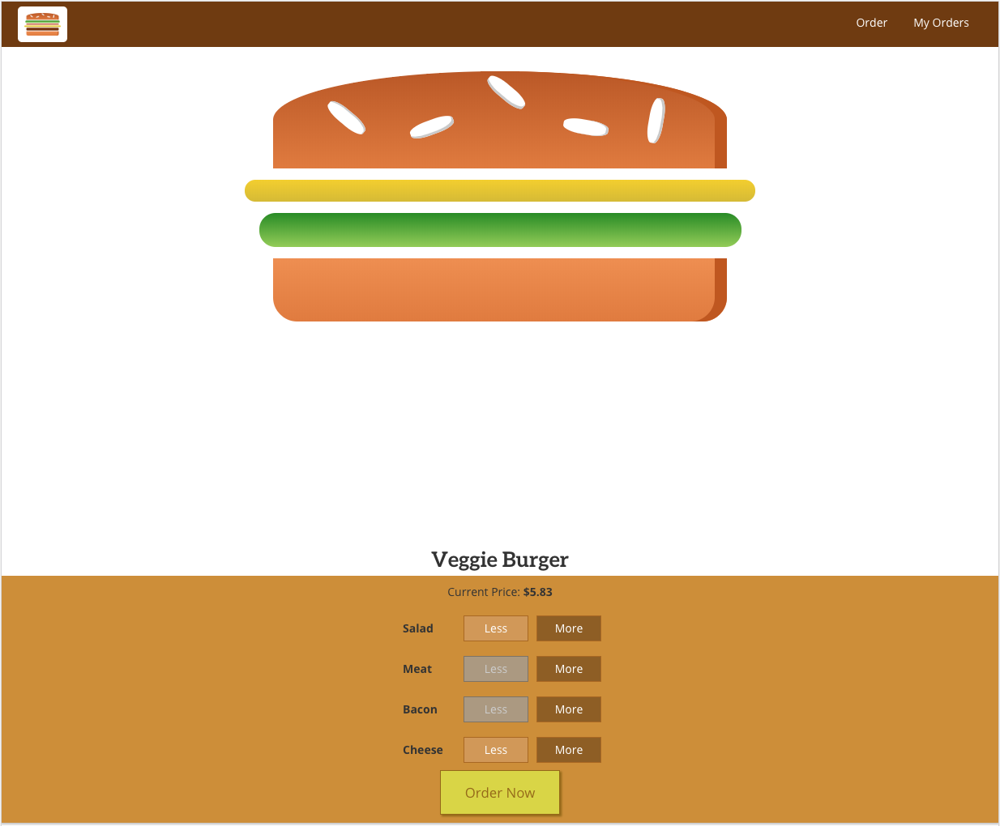
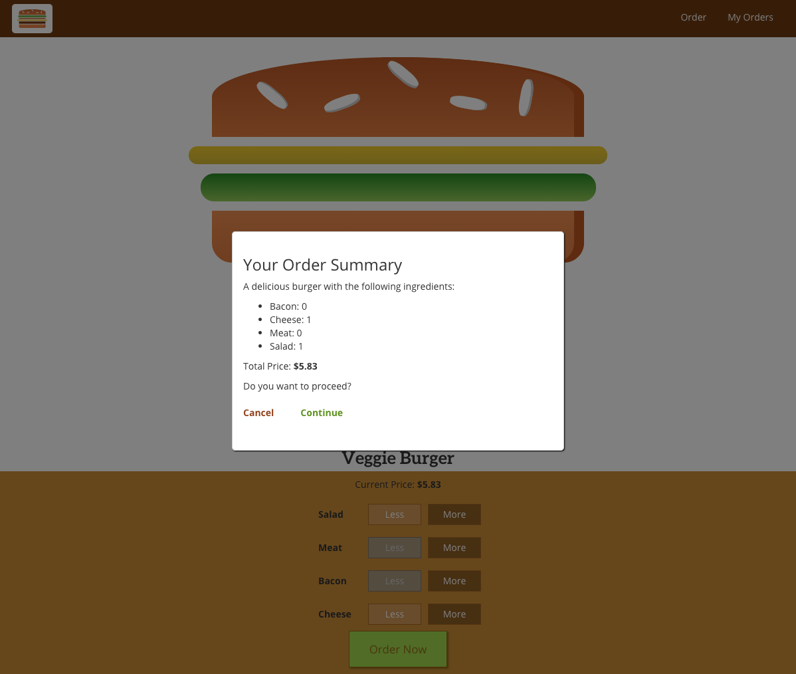
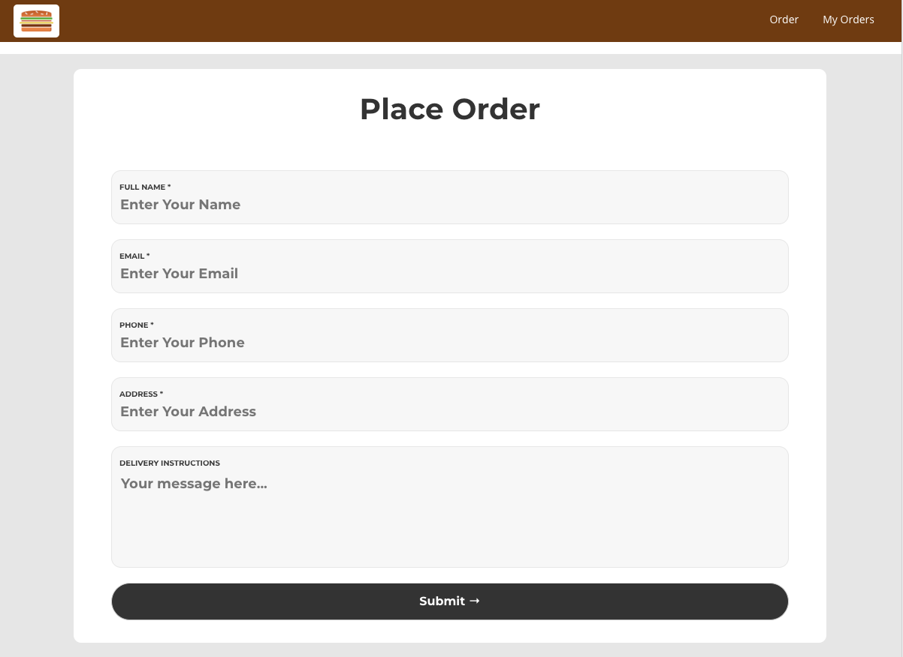
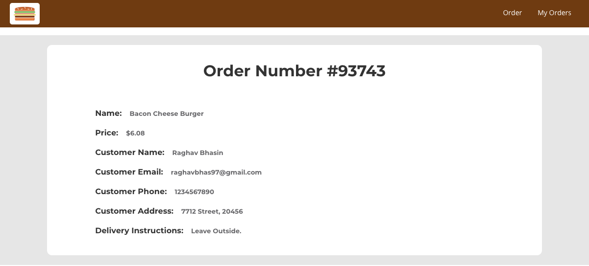
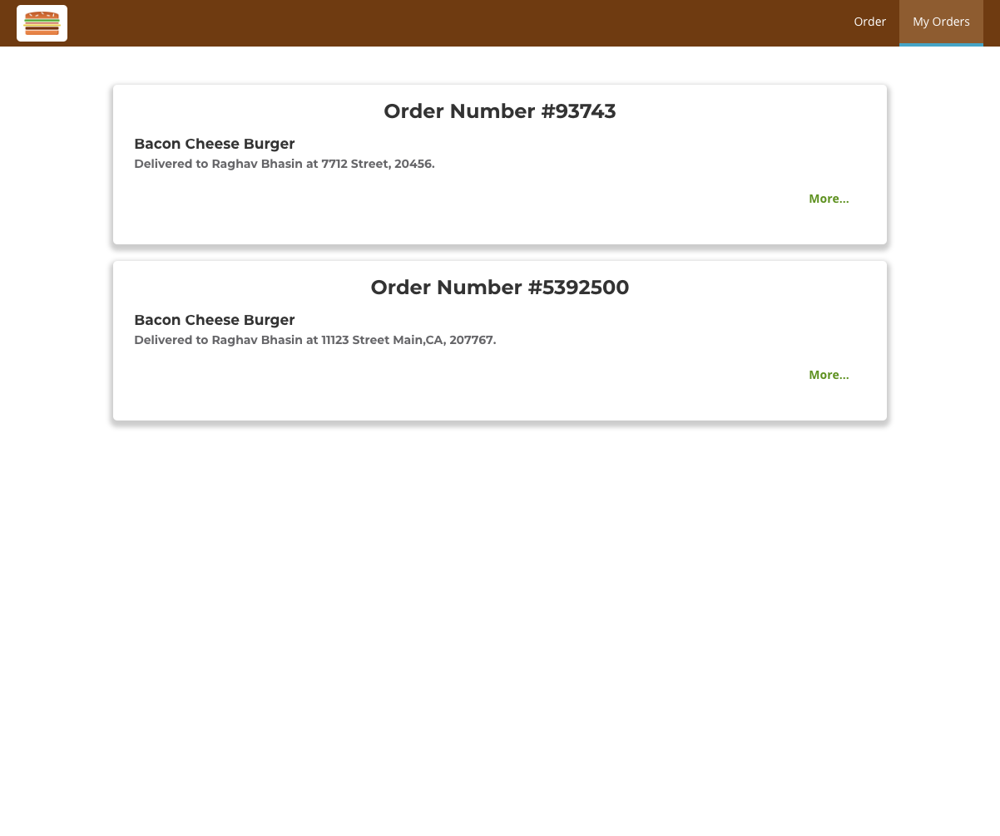

# Burger Shop

A React.js app that allows browsing through, menu of burgers, creating your custom burger & placing an order.

#### Menu
<kbd></kbd>

#### Burger Builder
<kbd></kbd>

#### Order Summary
<kbd></kbd>

#### Information Page
<kbd></kbd>

#### Order Confirmation
<kbd></kbd>

#### Past Orders
<kbd></kbd>

## Features
- [x] Browsing through a menu of burger's
- [x] Customizing your burger.
- [x] Placing an order.
- [x] Summary of order placed.
- [x] List of past orders.

## Requirements

- Webpack
- React.js
- npm
- Firebase

## Meta

Raghav Bhasin – [@bhasin97](https://github.com/raghavbhasin97) – raghavbhasin97@gmail.com

